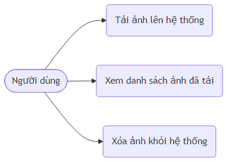
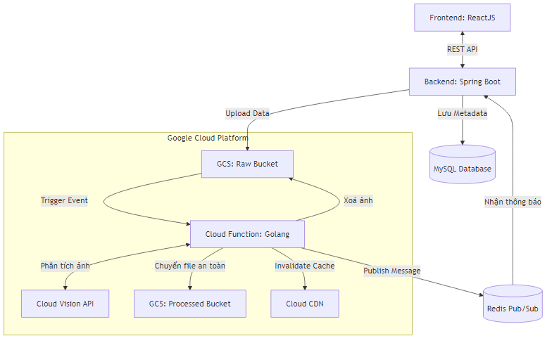
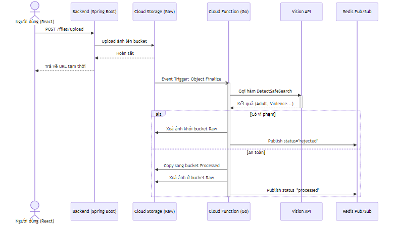
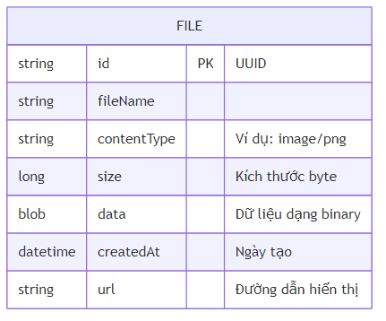

**Tên trường:** Đại học Giao thông vận tải TP.HCM - **Khoa:** Công nghệ thông tin

**Môn học:** Điện toán đám mây [010412303905]

**Giảng viên hướng dẫn:** GV. NGUYỄN VĂN ĐÔN

**Nhóm thực hiện:** Nhóm 8

**Danh sách thành viên:**

1. **Trần Tuấn Anh** - MSSV: 072205000267 _(Vai trò: Cloud & Deployment)_
2. **Trần Hoàng Phương** - MSSV: 083205005715 _(Vai trò: Backend )_
3. **Trần Hải Đăng** - MSSV: 095205006586 _(Vai trò: Frontend & Documentation)_

**Link mã nguồn:** [Đường dẫn GitHub dự án](https://github.com/DannyTuanAnh/image-processing-app)

```{=openxml}
<w:p><w:r><w:br w:type="page"/></w:r></w:p>
```

# MỤC LỤC

```{=openxml}
<w:p><w:r><w:fldChar w:fldCharType="begin"/></w:r><w:r><w:instrText xml:space="preserve"> TOC \o "1-3" \h \z \u </w:instrText></w:r><w:r><w:fldChar w:fldCharType="separate"/></w:r><w:r><w:fldChar w:fldCharType="end"/></w:r></w:p>
```

```{=openxml}
<w:p><w:r><w:br w:type="page"/></w:r></w:p>
```

# CHƯƠNG 1: GIỚI THIỆU

## 1.1. Lý do chọn đề tài

Trong bối cảnh số hóa mạnh mẽ, lượng dữ liệu hình ảnh được người dùng tải lên các nền tảng trực tuyến đang gia tăng với tốc độ chóng mặt. Việc quản lý thủ công khối lượng dữ liệu khổng lồ này không chỉ tốn kém về thời gian, công sức mà còn khó có thể đảm bảo tính nhất quán và hiệu quả. Điều này đặt ra yêu cầu cấp thiết về một hệ thống tải ảnh và quản lý lưu trữ hiện đại, tích hợp khả năng kiểm duyệt nội dung tự động.

Hơn nữa, sự phát triển của trí tuệ nhân tạo đã mở ra những giải pháp đột phá cho bài toán kiểm duyệt. Các công nghệ AI như thị giác máy tính (Computer Vision) có khả năng phân tích, nhận diện và phân loại nội dung hình ảnh với độ chính xác cao, hỗ trợ đắc lực cho việc lọc bỏ các nội dung không phù hợp, đặc biệt là các hình ảnh chứa yếu tố nhạy cảm, bạo lực hoặc vi phạm tiêu chuẩn cộng đồng. Việc áp dụng AI vào quy trình này không chỉ giúp giảm tải cho con người mà còn góp phần xây dựng một môi trường số an toàn, lành mạnh, đặc biệt quan trọng đối với sự phát triển của trẻ em.

Xuất phát từ những lý do trên, nhóm đã quyết định thực hiện đề tài "Hệ thống quản lý và kiểm duyệt ảnh tự động trên nền tảng Cloud", nhằm xây dựng một giải pháp toàn diện, tận dụng sức mạnh của điện toán đám mây và trí tuệ nhân tạo để giải quyết các thách thức hiện tại trong quản lý dữ liệu hình ảnh.

## 1.2. Mục tiêu đề tài

- Xây dựng hệ thống quản lý và tải hình ảnh (đặc biệt là ảnh đại diện/avatar).
- Tạo tiền đề tích hợp trí tuệ nhân tạo (Cloud Vision API) để phát hiện và phân loại các nội dung vi phạm tiêu chuẩn (nhạy cảm, bạo lực...).
- Đảm bảo tính ổn định và lưu trữ an toàn trên nền tảng điện toán đám mây.

## 1.3. Phạm vi đề tài

- Hệ thống tập trung vào xử lý và kiểm duyệt hình ảnh tĩnh.
- Sử dụng Google Cloud Storage để lưu trữ và phân loại file thực tế.
- Backend xử lý nghiệp vụ viết bằng Java Spring Boot, lưu metadata bằng MySQL.
- Hệ thống kiểm duyệt tự động xử lý ngầm bằng Cloud Function (viết bằng Golang) tích hợp Google Cloud Vision API và Redis Pub/Sub.

## 1.4. Phương pháp thực hiện

- Kết hợp linh hoạt kiến trúc RESTful API đồng bộ (Frontend - Backend) và kiến trúc Event-driven (Cloud Function).
- Sử dụng sự kiện (Event trigger) từ Google Cloud Storage để tự động kích hoạt tiến trình kiểm duyệt bằng Vision API.
- Ứng dụng Redis làm Message Broker (Pub/Sub) và Invalid Cache trên CDN để đồng bộ trạng thái luồng bất đồng bộ.

# CHƯƠNG 2: CƠ SỞ LÝ THUYẾT

## 2.1. Kiểm duyệt nội dung

- **Khái niệm:** Là quá trình theo dõi, đánh giá và quyết định xem nội dung do người dùng tạo ra (User-Generated Content) có phù hợp với các quy định, chính sách của nền tảng hay không.
- **Các loại vi phạm thường gặp:** Nội dung người lớn (Adult/NSFW), bạo lực (Violence), nội dung gây sốc (Medical/Racy).

## 2.2. Kiến trúc Hướng sự kiện và Pub/Sub

- **Khái niệm:** Các thành phần trong hệ thống không giao tiếp trực tiếp mà thông qua các sự kiện (events). Khi ảnh được tải lên Storage, sự kiện sinh ra sẽ kích hoạt tự động tiến trình kiểm duyệt.
- **Vai trò của Redis Pub/Sub:** Gửi thông báo (message) về trạng thái ảnh (bị loại bỏ hay an toàn) theo thời gian thực tới các dịch vụ đang lắng nghe mà không gây nghẽn luồng upload chính.

## 2.3. Google Cloud Storage

- Dịch vụ lưu trữ đối tượng (Object Storage) an toàn, linh hoạt và hiệu năng cao của Google.
- Phù hợp lưu trữ tài nguyên tĩnh như hình ảnh, video với tính sẵn sàng cao.

## 2.4. Cloud Vision API (SafeSearch Detection)

- Tính năng của Google Cloud Vision API giúp phân tích và đưa ra mức độ tự tin (Likelihood) đối với các hạng mục nội dung nhạy cảm.

# CHƯƠNG 3: PHÂN TÍCH & THIẾT KẾ HỆ THỐNG

## 3.1. Yêu cầu hệ thống

### Functional (Yêu cầu chức năng)

- Người dùng có thể upload hình ảnh lên hệ thống qua giao diện React một cách mượt mà.
- Hình ảnh được lưu trữ an toàn trên Google Cloud Storage.
- Lưu trữ lịch sử tải lên trong cơ sở dữ liệu MySQL và hiển thị lại cho người dùng.



### Non-functional (Yêu cầu phi chức năng)

- Khả năng lưu trữ lớn.
- Thời gian phản hồi API nhanh.
- Mã nguồn dễ bảo trì và mở rộng.

## 3.2. Kiến trúc tổng thể

Hệ thống kết hợp mô hình Client-Server truyền thống và Serverless (Event-driven):

1. **Frontend (ReactJS):** Giao diện tải ảnh lên và nhận phản hồi.
2. **Backend (Java Spring Boot):** Lưu trữ metadata vào MySQL và Upload dữ liệu thô (raw data).
3. **Google Cloud Storage (GCS):** Lưu trữ ảnh. Được chia làm 2 bucket: Raw (chứa ảnh vừa tải lên) và Processed (ảnh đã an toàn).
4. **Cloud Function (Golang):** Lắng nghe sự kiện file mới từ GCS Raw để xử lý.
5. **Vision API:** Nhận diện và đánh giá mức độ vi phạm SafeSearch.
6. **Redis Pub/Sub & Cloud CDN:** Đẩy thông báo kết quả và xoá cache ảnh.



## 3.3. Luồng xử lý (Workflow) hệ thống

1. **Upload gốc:** Frontend gọi API `POST /files/upload`. Backend nhận file, lưu metadata (MySQL) và đẩy byte data lên GCS (Raw bucket).
2. **Trigger sự kiện:** GCS kích hoạt Cloud Function (Golang) bằng sự kiện tạo mới object (Event `google.storage.object.finalize`).
3. **Phân tích Vision API:** Cloud Function gửi ảnh tới Vision API để kiểm tra SafeSearch (Adult, Violence...).
4. **Xử lý kết quả:**
   - **Nếu vi phạm (>= POSSIBLE):** Xoá file khỏi Raw bucket, gửi status `rejected` qua Redis Pub/Sub, và xoá CDN cache.
   - **Nếu an toàn:** Copy file sang Processed bucket, xoá file ở Raw bucket, gửi status `processed` qua Redis Pub/Sub.



## 3.4. Thiết kế Database

- **Bảng `File`:** Chứa các trường `id` (chuỗi UUID), `fileName`, `contentType`, `size`, `data` (binary), `createdAt`, và `url`.



# CHƯƠNG 4: CÀI ĐẶT HỆ THỐNG

## 4.1. Môi trường phát triển

- **Frontend:** React, Node.js.
- **Backend Upload:** Java 17, Spring Boot, MySQL 8.0.
- **Serverless & AI:** Golang 1.20+, Google Cloud Vision API, Cloud Function.
- **Message Broker:** Redis Pub/Sub.

## 4.2. Cài đặt Cloud Function và Vision API

- Khởi tạo hàm xử lý bằng Golang, cấu hình Event Trigger lắng nghe bucket thô.
- Sử dụng module `cloud.google.com/go/vision/apiv1` để gọi `DetectSafeSearch`.
- Tích hợp `github.com/redis/go-redis/v9` để publish message qua kênh `image-processing-results`.

## 4.3. Cài đặt Frontend (React)

- Sử dụng `UploadContext` để quản lý global state của quá trình tải ảnh (Trạng thái: welcome, upload, processing, completed).
- Gọi RESTful API bằng phương thức bất đồng bộ `async/await` để đảm bảo UI không bị đóng băng (freeze).

## 4.4. Cấu hình Google Cloud Storage

- Khởi tạo bucket: `chat-app-avt-images-raw`.
- Thiết lập quyền (IAM) cho Service Account để Backend có quyền ghi (write) file lên Cloud.

# CHƯƠNG 5: KẾT QUẢ & ĐÁNH GIÁ

## 5.1. Kết quả đạt được

- Xây dựng thành công hệ thống upload ảnh từ đầu đến cuối (End-to-End).
- Hoàn thiện toàn bộ luồng pipeline: Upload đồng bộ -> Trigger sự kiện -> Phân tích bằng Vision API -> Gửi kết quả qua Redis.
- Tự động thanh lọc dữ liệu: Các ảnh vi phạm đều bị xóa ngay lập tức khỏi Storage và CDN.

## 5.2. Đánh giá

### Ưu điểm

- Kiến trúc sáng sủa, dễ dàng triển khai, bảo trì và tích hợp thêm tính năng mới.
- Việc tách biệt lưu trữ file trên Cloud Storage giúp giảm tải đáng kể cho server xử lý cục bộ.

### Nhược điểm

- Đang sử dụng luồng gọi API đồng bộ (Synchronous). Nếu sau này tích hợp Vision API kiểm duyệt trực tiếp, thời gian chờ upload của người dùng có thể tăng lên.
- Chưa có kiến trúc Event-driven (như Pub/Sub) để xử lý dữ liệu lớn theo thời gian thực.

# CHƯƠNG 6: HƯỚNG PHÁT TRIỂN

- Chuyển đổi một phần kiến trúc sang luồng bất đồng bộ (Asynchronous/Event-driven) sử dụng Message Broker (ví dụ: Google Cloud Pub/Sub) để quá trình kiểm duyệt không làm chặn (block) request của người dùng.
- Thêm cơ chế Authentication (xác thực) và Authorization (phân quyền) bằng JWT.

# CHƯƠNG 7: KẾT LUẬN

Đề tài đã hoàn thành tốt giai đoạn xây dựng nền tảng cốt lõi cho một hệ thống quản lý hình ảnh trên Cloud. Thông qua việc ứng dụng Java Spring Boot, React và Google Cloud Storage, dự án đảm bảo khả năng lưu trữ an toàn, truy xuất nhanh chóng và tạo bộ khung kiến trúc vững chắc. Điều này giúp hệ thống sẵn sàng mở rộng và áp dụng các mô hình AI như Vision API trong các giai đoạn phát triển tiếp theo.

# TÀI LIỆU THAM KHẢO

1. Tài liệu hướng dẫn Spring Boot (Spring Docs).
2. Nền tảng tài liệu Google Cloud Storage.
3. Tài liệu phát triển giao diện React (ReactJS Docs).
